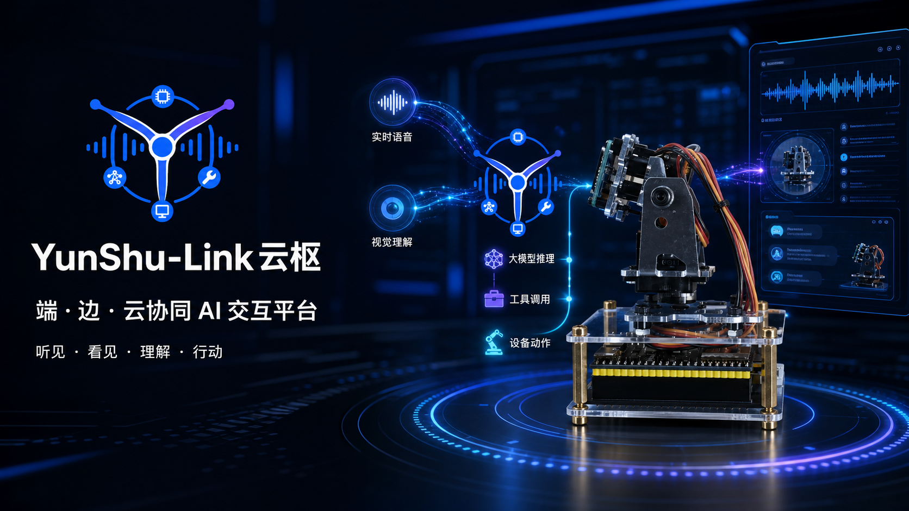
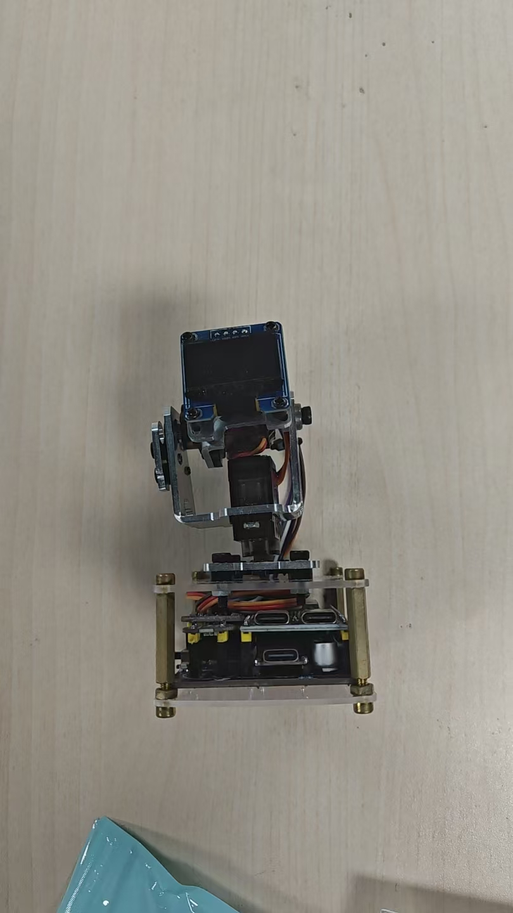
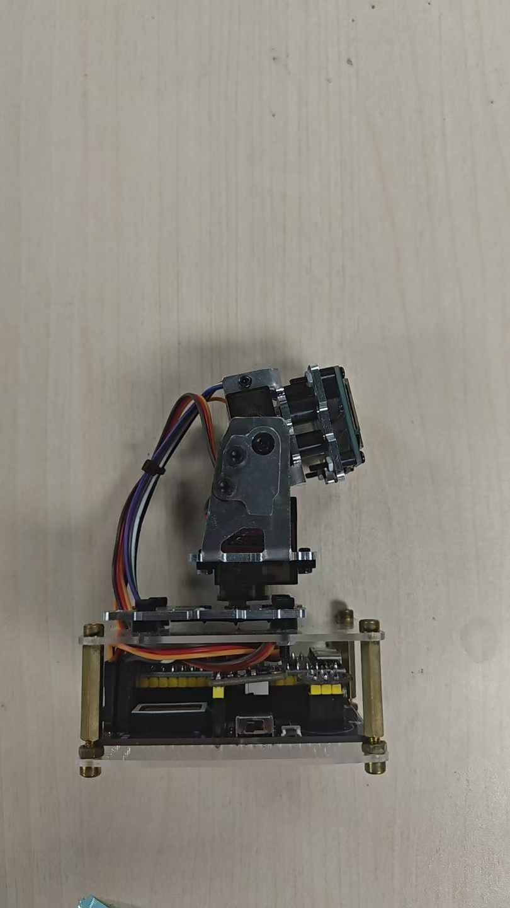
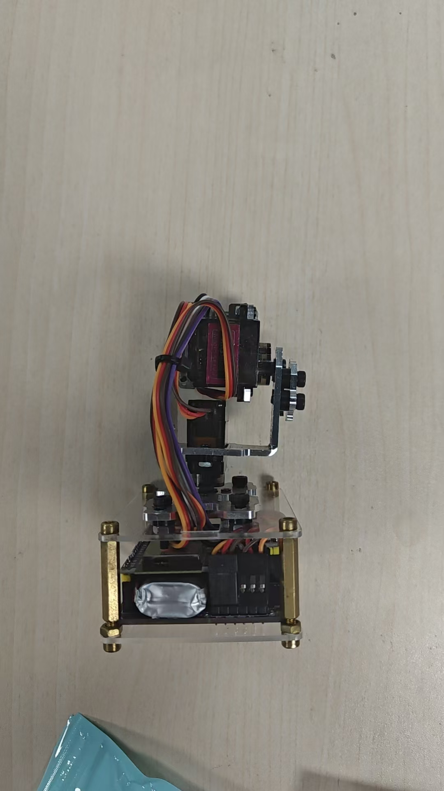
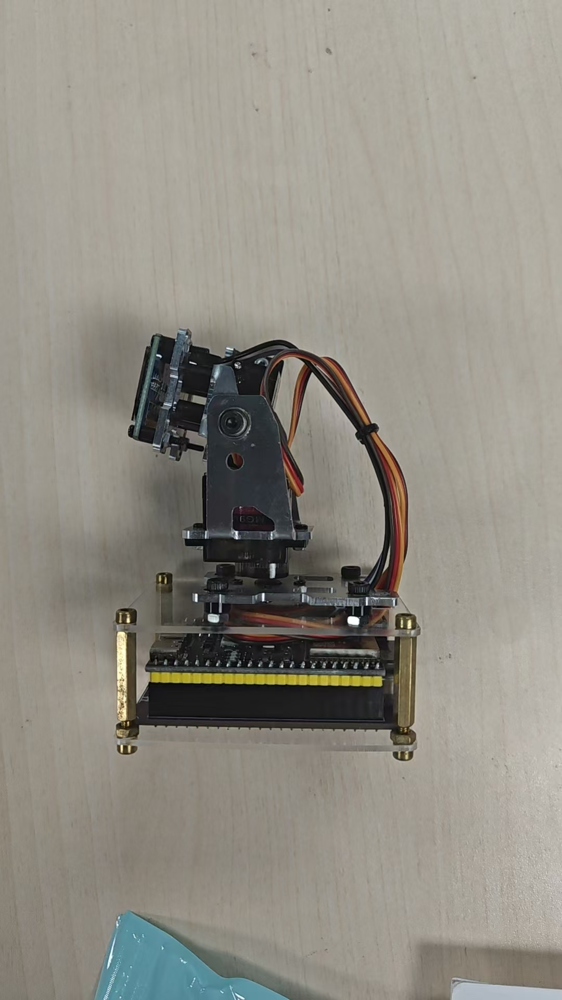

<p align="center">
  
</p>

<p align="center">
  
</p>

<h1 align="center">YunShu-Link（云枢）</h1>

<p align="center">
面向 ESP32 智能硬件的端—边—云协同 AI 交互平台<br/>
贯通「实时语音感知 → 大模型推理 → 语音合成 → 设备动作」完整链路<br/>
支持多智能体、知识库、视觉理解、记忆、工具调用与 Web 控制台
</p>

<p align="center">
  <a href="https://github.com/KingYeon-Zoo/YunShu-Link/releases/tag/demo-2026"><strong>观看演示</strong></a>
  ·
  <a href="./2026年全国大学生物联网设计竞赛设计文档.docx"><strong>设计文档</strong></a>
  ·
  <a href="./乐鑫竞赛命题.pdf"><strong>竞赛命题</strong></a>
</p>

<p align="center">
  
  
  
  
  
  
</p>

---

## 项目概览

**YunShu-Link** 是一套面向 [ESP32](https://github.com/78/xiaozhi-esp32) 智能硬件的全栈 AI 交互系统。项目围绕全国大学生物联网设计竞赛场景完成软硬件协同落地：设备可通过语音与视觉理解环境，由大模型规划回复或动作，并在 Web 控制台完成设备、智能体、模型和知识库的统一管理。

系统采用「实时 AI 管线」与「控制台管理」分层架构：Python 服务负责低延迟语音与多模态交互，Java 服务负责多用户、多智能体、多设备的配置与下发，Vue 提供 Web 和移动端管理体验。ASR、LLM、TTS、记忆、意图等能力均以 Provider 方式接入，便于替换模型与持续扩展。

> 本项目在开源社区方案的基础上进行了大量二次开发与重构，后端交互逻辑、模块编排、工具调用与配置体系均为独立实现。仅供学习与研究使用，未经安全评测，请勿直接用于生产环境。

---

## 项目展示

### 实物原型

<p align="center">
  
  
  
  
</p>

### 管理控制台

<table>
  <tr>
    <td width="50%" align="center"><br><sub>数据总览与运行状态</sub></td>
    <td width="50%" align="center"><br><sub>智能体角色与能力配置</sub></td>
  </tr>
  <tr>
    <td width="50%" align="center"><br><sub>多设备会话与聊天记录</sub></td>
    <td width="50%" align="center"><br><sub>知识库与 RAG 内容管理</sub></td>
  </tr>
</table>

### 演示与参赛材料

| 材料 | 内容 | 链接 |
|------|------|------|
| 项目演示视频 | Web 控制台、实时语音交互、硬件动作与完整业务流程 | [在 GitHub Release 中观看/下载](https://github.com/KingYeon-Zoo/YunShu-Link/releases/tag/demo-2026) |
| 竞赛设计文档 | 系统方案、软硬件架构、关键算法、实现与测试 | [查看 Word 文档](./2026年全国大学生物联网设计竞赛设计文档.docx) |
| 乐鑫赛道命题 | 2026 全国大学生物联网设计竞赛乐鑫科技赛道 D | [在线阅读](./乐鑫竞赛命题.md) · [下载 PDF](./乐鑫竞赛命题.pdf) |

> 更多 Web 页面截图见 [`web 端图片/`](./web%20端图片/)，更多原型照片见 [`实物图片/`](./实物图片/)。

---

## 工程亮点

- **端—边—云闭环**：从 ESP32 音频采集、流式识别和大模型推理，到语音播报、MCP 工具调用与舵机动作，形成可运行的完整系统。
- **低延迟实时交互**：基于 asyncio、WebSocket 与流式 ASR/TTS 构建连接级编排，支持边说边识别、实时打断和会话状态管理。
- **模型能力可插拔**：统一抽象 ASR、LLM、TTS、VLLM、VAD、Memory、Intent Provider，兼容云端模型与本地推理服务。
- **可运营的管理平台**：覆盖账号、设备、智能体、模型、音色、知识库、会话记录与系统参数，不止于单次硬件 Demo。
- **可复现演示环境**：提供 Docker 编排、一键开发启动器、固定演示数据、数据库备份恢复与离线校验脚本。
- **全栈工程实践**：项目横跨 Python、Java/Spring Boot、Vue、MySQL、Redis、MQTT、Docker 与 ESP32 设备协议。

---

## 核心特性

| 能力 | 说明 |
|------|------|
| 🎙️ 实时语音交互 | 流式 ASR + 流式 TTS + VAD 语音活动检测，支持多语言与实时打断 |
| 🧠 智能对话 | 兼容任意 OpenAI 接口协议的 LLM，支持 Ollama / Dify / Coze / FastGPT / Xinference |
| 👁️ 视觉感知 | 接入 VLLM 视觉大模型，实现拍照识物等多模态交互 |
| 🗣️ 声纹识别 | 多用户声纹注册与识别，与 ASR 并行，实时区分说话人并个性化回应 |
| 🎯 意图理解 | 大模型函数调用（function_call）/ 独立意图识别 / 无意图三种模式 |
| 🧩 工具调用 | 支持 IoT 协议、客户端 MCP、服务端 MCP、MCP 接入点，以及自定义插件函数 |
| 💾 记忆系统 | 本地短期记忆 / mem0ai / PowerMem 智能记忆，具备记忆总结能力 |
| 📚 知识库 | 接入 RAGFlow，让模型自主判断是否检索知识库后再回答 |
| 📡 指令下发 | 依托 MQTT 从控制台向 ESP32 设备下发 MCP 指令 |
| 🖥️ 控制台 | Web + 移动端双端管理，支持用户 / 设备 / 智能体 / 模型配置，多语言界面 |
| 🔌 插件热加载 | 启动时自动扫描注册插件函数，支持自定义扩展 |

---

## 技术架构

项目为多语言 monorepo，代码位于 `main/` 下的四个子系统：

| 子系统 | 目录 | 技术栈 | 职责 |
|--------|------|--------|------|
| 语音核心服务 | `main/xiaozhi-server` | Python 3.10 · asyncio | WebSocket / MQTT+UDP 语音管线、OTA 与视觉 HTTP 接口 |
| 控制台后端 | `main/manager-api` | Java 21 · Spring Boot 3.4 | 用户 / 设备 / 智能体管理、配置下发、鉴权 |
| 控制台 Web | `main/manager-web` | Vue 2 · Element UI | 智控台 Web 界面 |
| 控制台移动端 | `main/manager-mobile` | uni-app（Vue 3 + TS） | App / H5 / 各平台小程序 |
| 音频测试工具 | `main/digital-human` | Python · 静态页面 | 数字人与音频交互调试 |

### 设计要点

- **Provider 可插拔体系**：`xiaozhi-server/core/providers/` 下 `asr`、`tts`、`vad`、`llm`、`vllm`、`memory`、`intent` 各有抽象基类与多平台实现，通过配置的 `selected_module` 选择，热插拔无侵入。
- **连接级编排**：`core/connection.py` 为每个设备连接维护独立的对话状态与模块实例，统一调度语音收发、工具调用与流式输出。
- **插件自动注册**：`plugins_func/` 在启动时自动导入 `functions/` 下全部插件（天气、新闻、音乐、HomeAssistant、Web 搜索、RAGFlow 检索等），新增工具函数即插即用。
- **配置双模式**：语音服务既可读取本地 `data/.config.yaml` 独立运行，也可通过 `manager-api` 从控制台动态拉取配置，适配「最简化」与「全模块」两种部署形态。

---

## 快速开始

项目支持两种部署形态：

- **最简化安装**：仅运行 `xiaozhi-server`，配置存于本地文件，无需数据库，适合个人 / 单智能体场景。
- **全模块安装**：`xiaozhi-server` + `manager-api` + `manager-web` + MySQL + Redis，支持多用户、多智能体与控制台管理。

### 1. 语音核心服务（Python）

```bash
cd main/xiaozhi-server
conda create -n yunshu-link python=3.10 -y
conda activate yunshu-link
pip install -r requirements.txt

# 将根目录 config.yaml（或 config_from_api.yaml）复制为 data/.config.yaml 并填好密钥
python app.py                    # 默认 WebSocket :8000, HTTP :8003
```
> 需预先安装 `ffmpeg`。可用 `python performance_tester.py` 测试各模块响应速度。

### 2. 控制台后端（Java / Maven）

```bash
cd main/manager-api
mvn spring-boot:run              # http://localhost:8002/xiaozhi
# API 文档：http://localhost:8002/xiaozhi/doc.html
```

### 3. 控制台 Web（Vue）

```bash
cd main/manager-web
npm install
npm run serve                    # 开发服务器 :8001，代理至后端 :8002
```

### 4. 控制台移动端（uni-app）

```bash
cd main/manager-mobile
pnpm install                     # 强制使用 pnpm
pnpm dev:h5                      # 或 pnpm dev:mp-weixin / pnpm dev:app
```

### Docker 部署

根目录提供 `docker-setup.sh` 交互式脚本；`main/xiaozhi-server/` 下有 `docker-compose.yml`（仅服务）与 `docker-compose_all.yml`（服务 + Web + MySQL + Redis）。

### 一键混合开发环境

频繁修改前端和 Python 模型接口时，推荐在项目根目录运行：

```bash
./start-dev.sh
```

启动器采用混合模式：

- MySQL、Redis：Docker 常驻并持久化，日常启动不会重启或清空数据库。
- manager-api：在 Maven + Java 21 容器中运行，避免污染宿主机 Java 环境。
- manager-web：在宿主机运行并热更新，依赖隔离在项目自己的 `node_modules`。
- xiaozhi-server：在宿主机独立的 Python 3.10 环境中运行；优先用 Conda 同时隔离 FFmpeg，也支持 uv。

启动后会显示中文数字菜单。输入 `1` 可保留数据库并启动开发环境；输入 `2`
会先备份旧数据，再初始化固定的演示账号、豆包模型、音色和角色配置，
并按本机局域网 IP 填好设备接入地址。
旧数据库会备份到 `main/xiaozhi-server/mysql/backups/` 或
`.demo-db-backups/`，不会直接删除。

需要在脚本里非交互调用时，菜单 `2` 的等价参数是 `./start-dev.sh start --demo`。
注意 `--init-db` 不是它的等价物：那个只重建空表结构，不写演示数据，
建出来的库既无法登录也没有模型配置。

首次启动需要下载 Maven、npm、Python 依赖和缺失的 SenseVoice 模型，耗时会较长。后续依赖文件没有变化时会自动跳过安装。

启动、演示初始化、状态、日志、单项重启、停止和环境检查都在菜单中完成，
不需要记忆额外命令。

开发地址：

- 前端热更新：`http://127.0.0.1:8001`
- 管理 API：`http://127.0.0.1:8002/xiaozhi`
- WebSocket：`ws://127.0.0.1:8000/xiaozhi/v1/`
- HTTP/Vision：`http://127.0.0.1:8003`

---

## 支持的模型与平台

| 类别 | 支持 |
|------|------|
| **LLM** | 阿里百炼、火山引擎、DeepSeek、智谱、Gemini、讯飞、Ollama、Dify、FastGPT、Coze、Xinference、HomeAssistant（及任意 OpenAI 兼容接口） |
| **VLLM** | 阿里百炼、智谱 ChatGLM VLLM（及任意 OpenAI 兼容接口） |
| **TTS** | EdgeTTS、讯飞、火山引擎、腾讯云、阿里云 / 百炼、Minimax、灵犀流式、OpenAI TTS、FishSpeech、GPT-SoVITS、Index-TTS、PaddleSpeech 等 |
| **ASR** | FunASR、SherpaASR（本地）；火山、讯飞、腾讯、阿里、百度、OpenAI（接口） |
| **VAD** | SileroVAD（本地） |
| **声纹** | 3D-Speaker（本地） |
| **记忆** | mem_local_short、mem0ai、PowerMem、nomem |
| **意图** | function_call、intent_llm、nointent |
| **知识库** | RAGFlow |

---

## 目录结构

```
YunShu-Link/
├── main/
│   ├── xiaozhi-server/     # Python 语音核心服务
│   │   ├── app.py          # 启动入口（WebSocket + HTTP）
│   │   ├── core/           # 连接编排、providers、handle、api
│   │   └── plugins_func/   # 可扩展工具函数插件
│   ├── manager-api/        # Spring Boot 控制台后端
│   ├── manager-web/        # Vue 控制台 Web
│   ├── manager-mobile/     # uni-app 控制台移动端
│   └── digital-human/      # 音频交互测试工具
├── docs/                   # 各能力集成文档
├── scripts/demo/           # 可复现演示数据与重置工具
├── web 端图片/             # 管理控制台展示截图
├── 实物图片/               # 硬件原型照片
├── docker-setup.sh         # 一键部署脚本
└── start-dev.sh            # 一键混合开发环境
```

更多集成细节见 `docs/` 目录（如 `mcp-endpoint-integration.md`、`ragflow-integration.md`、`voiceprint-integration.md` 等）。

---

## 许可证

本项目基于 [MIT License](LICENSE) 开源。

本项目为独立二次开发作品，其架构参考并衍生自开源项目 [xiaozhi-esp32-server](https://github.com/xinnan-tech/xiaozhi-esp32-server)（MIT License）。按照 MIT 许可要求，已在 LICENSE 中保留原始版权声明。
