# 2026 年全国大学生物联网设计竞赛命题 乐鑫科技赛道 D

AIoT 智联万物 —— 基于乐鑫 ESP 系列芯片与大模 型的全场景创新应用赛（点击查看完整赛题资源）

乐鑫为参赛者提供完整、成熟的 AIoT 开发生态：

ü 开箱即用的开发套件；

ü 处理器内置AI加速指令，开发板原生集成Wi-Fi与蓝牙连接能力；

ü 支持Arduino与ESP-IDF官方物联网框架多环境开发；

ü 丰富的教学资源、实践课程、应用示例；

ü 背后是180,000+ 开源代码仓（ESP32项目日均增长超150个）、近1,000份官方技术 文档，以及300万+ 全球开发者社区持续沉淀的Demo、例程与实战经验。

从入门到进阶，从创意验证到作品落地，乐鑫将为你的赛题创作提供源源不断的灵感与坚实 支撑。

## 1. 赛题任务

在生成式人工智能与边缘计算深度融合的智能化时代，硬件终端的实时感知能力与云端大 模型的认知决策能力的深度融合，成为推动AIoT技术跨领域创新与产业升级的关键。本次 竞赛鼓励参赛者基于乐鑫 ESP32-S3、ESP32-C5 或 ESP32-P4 系列芯片的 AIoT 开发平台， 结合云端大模型技术，打破场景边界限制，自主挖掘各领域应用需求，打造具备场景理解、 自主决策和持续进化能力的AIoT创新应用，重点解决各场景中的实际痛点、个性化服务与 创新应用探索需求，充分释放AIoT的技术融合潜力与跨领域应用价值。

1.1 技术要求（必备项）

• 必须使用乐鑫 ESP32-S3、ESP32-C5、ESP32-P4 系列芯片中的其中一款作为核心主控

• 至少实现1种传感器的数据融合

• 需对接至少1个云端大模型服务

• 设备可响应大模型下发指令（下行交互），或向大模型上传并由其处理除音视频外的各 类感知数据（上行交互）

## 1.2 创新维度（加分项）

• 场景：鼓励挖掘工业、校园、康养、社区、出行、文创等各领域未商业化 / 待优化的全 新应用场景，针对实际痛点提出创新性解决方案

• 技术：边缘AI计算、传感器多源数据融合、低功耗等核心技术的创新应用

• 交互：探索姿态感应、隔空操作、环境感知触发、多模态交互等多元交互方式

• 形态：结合应用场景，优化PCB布局、3D结构设计，兼顾实用性与工业设计

• 实用：聚焦节能降耗、普惠便捷、安全生产、高效服务等实际需求

## 1.3 场景选型推荐

## ü 智能家居、智慧城市及通用物联网场景

ESP32-S3方案通用性强，具备完善的数据处理与网络连接能力，开源生态成熟、资料最全， 可适配多场景下的数据采集与处理需求。ESP32-C5支持2.4G/5G双频Wi-Fi 6，具备多协议 适配性；使用基于 ESP32-C5 芯片的 ESP-SensairShuttle 开发板，可灵活对接各类传感器， 快速实现环境监测、安防预警等功能，同时支持与云端大模型的上下行数据交互。

## ü 屏显及视觉类应用场景

ESP32-P4 搭载高性能处理器，参考 esp-who 仓库示例本地模型运行与推理能力，可支撑行 人检测、人脸识别等视觉计算任务的本地模型部署，同时适配LVGL屏显驱动及各类图像、 视频类应用场景。

## ü 智能可穿戴产品、医疗康复场景

选用 ESP32-S3 与 ESP32-C5 进行生理数据采集与边缘计算，可搭配健康传感器实现心率、 血氧等体征数据监测，对接大模型即可输出个性化健康建议。

## ü 互动娱乐、手势遥控器、游戏控制器场景

ESP-SensairShuttle(ESP32-C5) 开发板出厂固件即具备动作感知、AI 语音能力。凭借 LCD、 麦克风等丰富外设接口，可快速开发手势识别、语音控制、无缝对接大模型的交互作品。

## 重要提示：

为了帮助同学们快速了解如何使用乐鑫软硬件开发资源，我们制作了一些简单的应用实例， 请见3. 应用示例及相关资源。

## 2. 开发资源

本届赛题指定主控芯片为乐鑫 ESP32-S3、ESP32-C5、ESP32-P4 系列（三选一），诚邀你 融合边缘计算与多维感知技术，在嵌入式世界里锻造兼具灵魂创新与实战价值的智能杰作。

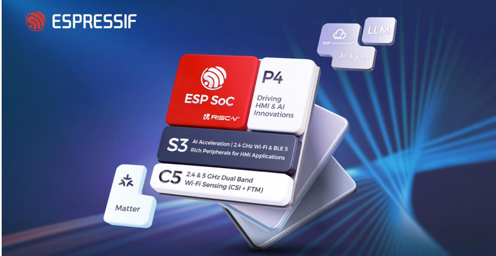

乐鑫为本次大赛提供软硬件一体的开发资源。硬件上，每个参赛队伍可以在以下 3 组开发 套件中选择 1 组进行开发，大赛主办方将为参赛队伍免费寄送硬件开发套件。软件上，乐 鑫提供开源的操作系统和软件资源，访问 GitHub 链接即可使用相应 SDK。

## 重要提示：

乐鑫开发套件申领采取限量寄送模式，每组开发套件上标明了限量数，领完即止。未正 式提交有效作品的队伍需将领用的开发板退回。

如果您需要的开发套件已被领完，或您需要更多的乐鑫开发板、模组、芯片以及其他组 件完成作品，可前往官方淘宝店铺“乐鑫科技 Espressif Online”和 “M5Stack 企业店铺”选购。

参赛选手也可以选择自制电路板或自行购买其他开发板，但主控芯片型号必须是 ESP32-S3、ESP32-C5或ESP32-P4（自制开发板需在电路板丝印层印制加工时间，并注意不 要出现学校、老师或学生姓名等敏感信息）。嘉立创为乐鑫参赛团队提供EDA打印打样券， 有需要的团队可点击此处填写问卷申领。

## 2.1 硬件资源（3 选 1）

<table><tr><td>编号</td><td>开发板</td><td>板材简介</td><td>产品特性</td></tr><tr><td>套件1ESP32-C5动作感知+大模型人机交互场景(500套)</td><td>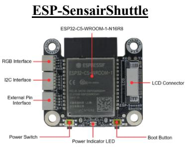</td><td>ESP-SensairShuttle 由乐鑫联合Bosch Sensortec 打造,以 ESP32-C5为主控,聚焦动作感知与大模型人机交互场景,可更换博世传感器子板实现多维度数据采集。出厂固件即支持动作、手势识别、xiaozhi对话等</td><td>搭载 ESP32-C5-WROOM-1-N16R8 模组配备 BME690、BMI270&amp;BMM350 传感器子板,实现空气质量、姿态、地磁等多维度感知配备 LCD、麦克风、扬声器接口,支持 1.83 英寸屏显与 AI 语音交互,无缝对接大语言模型含 I2C、RGB 灯带、外置引脚等接口,支持各类外设拓展,GPIO 引脚可灵活开发</td></tr><tr><td>套件2ESP32-P4语音+图像处理方向(250套)</td><td>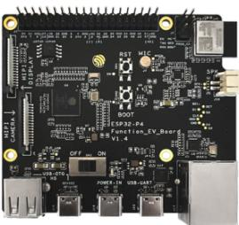</td><td>ESP32-P4-Function-EV-Board 是基于 ESP32-P4 芯片打造的高性能多媒体开发板,支持最大 32 MB PSRAM,集成丰富外设,可满足多媒体产品开发需求,适配音视频类物联网应用</td><td>搭载 ESP32-P4 双核 RISC-V 处理器搭配 ESP32-C6-MINI-1 模组,支持 2.4GHz Wi-Fi 6 &amp; Bluetooth 5 (LE)H.264 视频编码音频输入/输出 (板载 ES8311 编解码器)LCD 接口 (支持 ek79007/ili9881c/lt8912b 屏)可选 7 英寸电容触摸屏 (GT911)支持 MIPI-CSI/DSI 接口支持 USB 2.0 High SpeedPIE 扩展指令集(AI 加速)</td></tr><tr><td>套件3ESP32-S3核心板(550套)</td><td>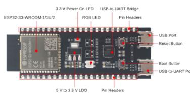</td><td>ESP32-S3-DevKitC-1 是一款基础开发板,支持 Wi-Fi + Bluetooth® LE,板上大部分管脚均引出至两侧排针,可灵活跳线连接各类外围设备、适配面包板使用,硬件拓展性极强;配套官方例程资源丰富,是入门与创新开发的高适配万能板卡</td><td>搭载 ESP32-S3-WROOM-1/1U 模组Xtensa® LX7 双核 @ 240MHzPIE 扩展指令集 (AI 加速)2.4 GHz Wi-Fi &amp; Bluetooth 5 (LE)双 Micro-USB (UART / Native USB)丰富的 GPIO 排针引出</td></tr></table>

## 2.2 云端大模型

## 2.2.1 乐鑫赛题专项云应用额度

火山引擎

<table><tr><td>软件资源</td><td>软件介绍</td><td>额度</td><td>软件资源</td><td>软件介绍</td><td>额度</td></tr><tr><td>边缘大模型网关</td><td>边缘大模型网关(AI Gateway)允许您通过一个API接口访问多家大模型提供商的模型与智能体。边缘大模型网关部署在遍布全球的边缘计算节点上,使端侧应用能够就近接入,显著提高模型访问速度;内置语义缓存机制,减少模型调用请求的回源次数,为终端用户提供更快速、更可靠的AI服务体验。</td><td>200w token免费额度,用于调用边缘大模型网关的平台预置模型与智能体,提工单申请,备注乐鑫物联网大赛,按需补充产品开通产品文档</td><td>星河社区(AI Studio)大模型 API开发者专项资源</td><td>本资源由百度飞桨星河社区提供,旨在为开发者、参赛选手及合作伙伴提供领先的文心一言(ERNIE)系列大模型调用能力。通过该API,您可以将强大的自然语言理解、生成、逻辑推理等能力集成至您的应用或项目中。</td><td>为了支持您的项目开发,我们提供了分阶段的Token额度支持:新用户初创包:成功开通后的首月,系统将自动注入1,000,000 Token初始额度,供您进行基础调试与Demo开发。续期扩容包:若初始额度用尽,您可以提交UID进行申请。审核通过后,我们将为您单次充值2,000,000 Token。注:扩容申请不限次数,我们将根据您的项目进度及使用合规性进行持续支持。</td></tr><tr><td>硬件对话智能体</td><td>硬件对话智能体是一个端到端的智能硬件对话开发平台,兼容主流 IoT芯片,可快速帮助开发者将低延迟、高自然的AI对话能力集成到智能硬件中,让智能硬件会听、会看、会说话,适用于AI玩具、智能穿戴设备、陪伴机器人、智能家居、教育硬件、具身智能设备等场景。</td><td>10个基础版本 license(每个license包含9小时语音以及1350K tokens,单设备可以通过注册不同device name共用10个license所有额度)产品开通产品文档GitHub代码仓</td><td></td><td></td><td>资源申领指南</td></tr></table>

申领资源前，请注意已完成：注册火山账号、账号实名认证

申领资源前，请注意已完成：注册百度飞桨账号、账号实名认证

Deepseek

## 2.3 开发环境

本次竞赛推荐使用 ESP-IDF v5.5.2。

ESP-IDF 是乐鑫官方的物联网开发框架，它基于 C/C++ 语言提供了一个自给自足的 SDK，方便用户开发通用应用程序。ESP-IDF 集成了大量的软件组 件，拥有丰富的文档和示例资源。点此观看【乐鑫教程】｜使用一键安装工具快速搭建 ESP-IDF 开发环境 (Windows)。

## 重要提示：

• 极狐镜像：为了解决国内开发者从GitHub克隆仓库慢的问题，我们已将ESP-IDF和部分重要仓库及其关联的子模块镜像到了极狐仓库，这些仓库将 自动从GitHub原始仓库同步。

除 ESP-IDF 以外，ESP32-S3 还支持 Arduino（搭建教程，GitHub，Gitee）等开发环境。同学们可以自行选择使用。

• 下方第2.4节中列明的软件资源需基于 ESP-IDF 使用，仅部分软件资源支持第三方开发环境，例如 ESP RainMaker、ESP-NOW。

## 2.4 相关技术资源

<table><tr><td colspan="6">硬件驱动与基础系统功能</td></tr><tr><td>ESP-IDF(基础平台与驱动)</td><td>ADC(电压测量、电池管理)</td><td>button 组件</td><td>LED 组件</td><td>音频组件</td><td>I2C 组件</td></tr><tr><td colspan="6">语音交互功能(语音助手、大模型对话、天气查询、音乐播放)</td></tr><tr><td>SR(语音识别与唤醒)</td><td>AFE(音频前端算法)</td><td colspan="2">ESP-ADF(音频框架、audio-player 组件)</td><td>ESP-RainMaker(云服务)</td><td>Provisioning(配网例程)</td></tr><tr><td colspan="6">图像识别与动作检测功能(人脸识别、动作检测)</td></tr><tr><td>ESP-WHO(图像识别)</td><td>ESP-DL(本地 AI 推理)</td><td>摄像头组件(ESP32-CAM/ESP32-S3-EYE)</td><td>视频组件(ESP-Video)</td><td></td><td></td></tr><tr><td colspan="6">显示与交互</td></tr><tr><td>esp-brookesia 人机交互开发框架</td><td>lottie(动画效果、lottie 组件)</td><td colspan="2">轻量 UI 渲染引擎(支持动画、图片、文字、二维码)</td><td>LVGL(图形界面)</td><td>Touch 触摸屏幕交互(touch_button、touch_sensor)</td></tr><tr><td colspan="6">网络与通讯功能</td></tr><tr><td>Wi-Fi(网络连接与云交互)</td><td>MQTT(消息通讯协议,设备与服务器交互)</td><td>HTTP(网页通讯协议,OTA 升级等)</td><td>ESP-NOW(实时无线遥控通信)</td><td>低功耗</td><td></td></tr></table>

## 3. 应用示例及相关资源

为了帮助同学们快速上手，我们提供了以下智能应用模型及参考资源链接。

## 3.1 应用示例

## 3.1.1 ESP32-P4 AI 机械臂无线协同方案

本项目在 ESP32-P4 部署了机械臂，它由两个组件组成：协同者和控制者

协同者：机械臂的主体，包括DM电机驱动器、视觉检 测和板载运动学模块。开源固件自带模式切换，协同模 式可通过ESP-NOW实现远程被控，自主模式可独立执 行边缘 AI 物体检测和抓取任务，无需额外计算平台。 您也可实现基于USB摄像头的物体识别和抓取任务。

• 控制者：基于 trlc-dk1 的小型机械臂，可通过 ESP-NOW

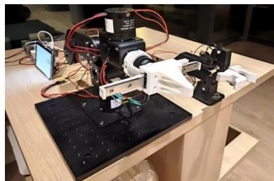

实现对协同者机械臂的远程控制，实现两个机械臂在 Wi-Fi 通信距离内的极低延迟协 同控制。

## 代码仓库

## 3.1.2 ESP-Spot 乐小方：AI 对话、动作识别、家居联动

ESP-Spot 是一款基于 ESP32-C5 / ESP32-S3 的 AI 动作语音 交互核心模块，适用于智能玩具、语音助手、智能家居控制 等物联网应用场景。它不仅有离线语音唤醒、AI 对话等功 能，同时设备内置六轴 IMU 和三轴地磁传感器，可以识别 多种姿态与动作，从而实现更丰富的交互。另外，通过 ESP32-S3自带的触摸/接近感应外设还可实现触摸感知。

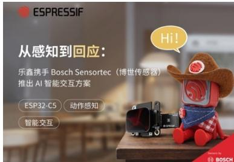

代码仓库 开源实践 视频展示1 视频展示2

## 3.1.3 EchoEar 喵伴：会听、会动、会陪伴的 AI 萌宠

EchoEar喵伴是乐鑫打造的智能AI开发套件，适用于玩具、 智能音箱、智能中控等需要大模型赋能的语音交互类产品。 该设备搭载 ESP32-S3-WROOM-1 模组，1.85 寸 QSPI 圆形 触摸屏，双麦阵列，支持离线语音唤醒与声源定位算法。结 合火山引擎提供的大模型能力，喵伴可实现全双工语音交 互、多模态识别与智能体控制，为开发者打造完整的端侧AI 应用体验提供坚实基础。

代码仓库 开源实践 视频展示

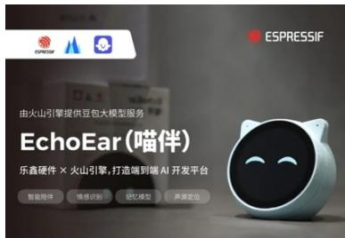

EchoEar 喵伴底座是为喵伴开发套件量身设计的底座，集成 ESP32-C61、旋转电机和磁力计，实现旋转、基于CSI的触 摸感知和磁力开关功能，提供更灵活、自然的感知交互体验。

代码仓库 开源实践 视频展示

## 3.1.4 ESP-SparkBot：大模型 AI 桌面机器人

ESP-SparkBot 基于 ESP32-S3 芯片设计，是一款集语音交互、 图像识别、遥控操作与多媒体功能于一体的智能机器人。 它不仅可以通过语音助手实现大模型对话、天气查询、音乐 播放等互动，还可以使用小度手机 APP 完成蓝牙配网、音 色切换、音乐播放及其他智能服务。同时，ESP-SparkBot内 置加速度传感器，支持摇骰子和2048游戏等娱乐交互功能。

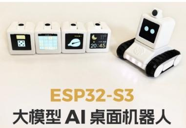

硬件方面，其磁吸式设计支持模块扩展，可轻松转换为遥控小车，实现摄像头实时传输和手 机操控。此外，设备支持本地 AI 处理，可以运行人脸识别和动作检测功能。还可以通过投 屏模块实现高清视频播放和游戏运行，展示强大的性能和多功能性。

代码仓库 开源实践 视频展示

## 3.1.5 小智 AI 聊天机器人（Xiaozhi AI Chatbot）

小智 AI 聊天机器人（Xiaozhi AI Chatbot）是基于 ESP32-S3 的大模型实时语音对话开源项目，已实现语音识别、自然语 言处理和语音合成功能，支持多种开发板适配。截至目前， 该项目在 GitHub 上获得了约 23.8k 颗星，和 5k fork。

代码仓库 开源实践

视频展示1 视频展示2 视频展示3

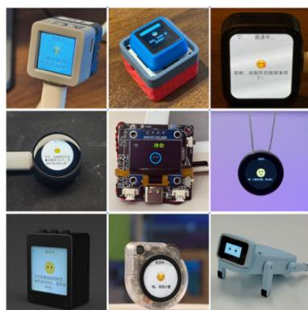

## 3.1.6 ESP-Drone 无人机方案

ESP-Drone 是基于乐鑫 ESP32/ESP32-S2/ESP32-S3 开发的小型无人机解决方案，可使用手 机 APP 或游戏手柄通过 Wi-Fi 网络进行连接和控制。该方案硬件结构简单，代码架构清 晰，支持功能扩展，可用于 STEAM 教育等领域。项目部分代码来自 Crazyflie 开源工程， 继承 GPL3.0 开源协议。

该项目是飞控相关知识的最好学习平台， 拥有完整的学习资料和开源代码，欢迎大 家在此基础上做出自己的无人机作品。

开源实践

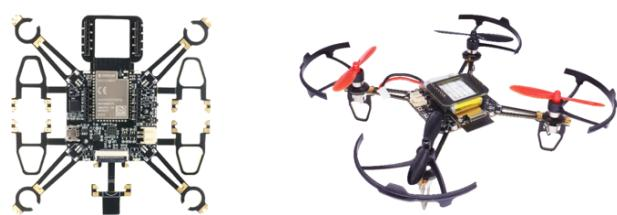

## 3.2 基于 ESP32 的第三方开源案例

## 3.2.1 助盲眼镜

该项目获得了魔搭社区AI公益比赛的一等奖。 相关链接：B 站，GitHub

在助盲方面，每年都会有类似的助残眼镜作品，建议同 学们考虑头戴式设备的便携性，如果作品较笨重，可以 不限于眼镜的外观，考虑马甲、腰带等更实用的造型。

## 3.2.2 自平衡方块

该项目 ID 是来源于苏黎世联邦理工学院的 Cubli，电机 驱动使用的是Simple FOC。低成本、小型化、简化后作 为作者的首个开源项目。

相关链接：B 站，GitHub

同学可参考该开源方案，升级为性能更强大的ESP32-P4 处理器去复刻类似的自平衡方块作品。由 P4 是全新芯 片，在独创性上具有强大说服力。

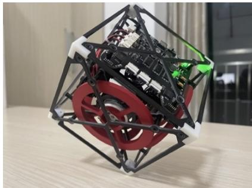

## 3.2.3 创意游戏：变色龙(esp-brookesia) UI 框架与 LVGL 游戏

该开发者用 ESP32-S3-LCD-EV-Board 做了一个 lvgl 的游戏合集，把目前 B 站流传的几个成 功的lvgl游戏移植到了ev-Board 上，游戏包括：羊了羊、消消乐、打砖块、植物大战僵尸 等等，载体是乐鑫新推出的物联网开发框架 (esp-brookesia)。

这个框架类似手机APP的运行界面和方式，每个程序独立管理互不影响，随着ESP32-P4芯 片的推出，无法阻挡着创客们往更加生动 UI 交互方向发展，作者分享了详细的移植方法。 相关链接

我们鼓励同学们在esp-brookesia 框架下进行更多app开发，该框架原生适配多种屏幕尺 寸。由于该框架完全开源，新建一个简单的app非常容易上手，又由于P4是新芯片，在独 创性上有很强的说服力。

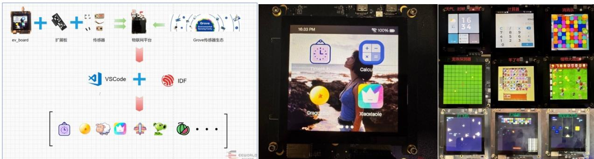

## 3.2.4 赛博宠物（机械臂控制）

该博主基于腾讯云智能体开发平台做了一个赛博机器鸭 宠物，眼睛可旋转具有多种表情，自主移动，AI对话视 觉互动，收拾垃圾，逗猫陪伴，该项目代码已开源。同学 们可利用ESP32-P4的边缘计算性能（物体识别，人脸识 别等），做出属于自己的赛博宠物。

相关链接：B 站，GitHub

## 3.2.5 ESPectre —— Wi-Fi 室内人体活动检测开源项目

5.7k stars 爆火的硬件开源项目，基于 Wi-Fi CSI（信道状 态信息），利用普通的ESP32芯片就可实现人体的存在 检测。相关链接：GitHub

同学们可利用ESP32-S3进行项目复刻，CSI软件组件拥

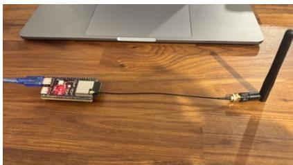

有详细的官方开源例程可以直接烧录体验。该无线感知能力纯靠软件实现，硬件成本友好， 同时具有强大的升级潜力。配合一些现有的实际项目，就可“无缝”升级新功能，实现炫酷的 实用功能，如人走灯灭，接近感应等，结合已有的作品场景，或许能碰撞出新的创意火花。 另外无线感知是新领域，创新方面具有独特优势。

除以上案例外，您还可在 GitHub、Gitee、CSDN、Reddit、Bilibili 等开放平台 搜索关键词“ESP32” 获取海量开源案例。

## 3.3 其他资源

ESP-friends 技术百科

ESP Friends: Demo 演示与软件源代码

乐鑫小铁匠: 开源硬件参考项目

M5Stack M5Burner

乐鑫 Gitee 开源仓库

CSDN 技术博客

乐鑫官方B站账号“乐鑫信息科技”

更多开放资源可点击查看乐鑫科技2026年物联网大赛赛题资源页、乐鑫大学计划。

## 4. 更多信息

## 4.1 官方答疑支持

如果同学们在应用开发的过程中遇到了一些问题，希望获得技术支持，您可以：

• 优先询问乐鑫官方AI助手

• 查阅常见问题总结 ESP-FAQ

• 在相关项目的 GitHub 页面提出新的 issue

• 乐鑫官方将为本次赛事设立专门的答疑群，供参赛选手与乐鑫工程师以及其他选手 进行交流和讨论（报名成功后组委会将通过邮件发送申领开发板和进群通知）

## 4.2 企业额外奖励

除大赛组委会统一的奖励外，乐鑫科技还提供以下奖励：

ü 进入决赛获得一等奖的优秀作品均有机会在乐鑫科技相关媒体平台上公开宣传，有机 会被邀请参加公司官方举办的技术研讨会、年度全球开发者大会等活动展示作品或发表演 讲。

ü 在本次大赛中表现突出的队伍成员，乐鑫将提供在上海、深圳研发中心的实习机会， 以及校招绿色通道的支持。

ü 入围全国总决赛的队伍成员，将有机会获得乐鑫生态公司内推机会。

ü 赛后按要求分享视频至社交媒体的队伍成员，将有机会获得价值500元的开发套件礼 盒，分享规则详见4.3 开源开放

## 4.3 开源开放

ü 本赛题鼓励参赛队的主体任务代码开源（开源协议不限），推荐将作品的设计说明、 项目代码、演示视频等资料发布于GitHub、Gitee、Bilibili或专业论坛等平台。知识产权归 属作者所有，乐鑫科技享有对参赛作品进行展示和其他形式宣传的权益。

ü 赛后鼓励录制一段时长为 1 至 5 分钟的高清视频，在抖音、小红书、B站、微博、 公众号等任一社媒，带 #ESP32 # # 话题发布。点击此处提交大赛反 馈及视频链接，将从中选取10名最佳分享队伍，送出价值500元的开发套件礼盒。

## 关于乐鑫

乐鑫科技(688018.SH)，全球前五大Wi-Fi芯片公司之一，是中国科创板首批上市企业，在中 国、捷克、印度、新加坡和巴西均设有办研发中心，拥有一支来自近 30 个国家和地区的国 际化团队。乐鑫专注于研发性能卓越、安全稳定、高性价比的AIoT SoC（知名产品包括ESP32、 ESP8266），开源的软件架构和稳定的物联网解决方案，为全球数亿用户提供领先的无线连 接、语音交互、人脸识别、人机交互数据管理和处理等服务，为全球客户所信赖，已连续8 年保持全球Wi-Fi MCU 市场份额第一。

乐鑫拥有深厚的核心自研技术积累，包括Wi-Fi/Bluetooth LE网络协议栈、射频技术、基于 RISC-V指令集的MCU架构、音视频编解码、Al向量指令和Al算法、操作系统、工具链、 编译器、AloT软件开发框架、云服务等，实现软硬件研发闭环。

## 关于M5STACK明栈（乐鑫旗下硬件品牌）

深圳市明栈信息科技有限公司(M5Stack) 是行业领先的物联网整体解决方案提供商，致力于 为全球开发者提供便捷、灵活的开发组件。我们供应堆叠式模块化物联网硬件，易于使用的 图形化软件平台，以及定制化的服务，为智能制造、智能楼宇、智慧零售、STEM教育等领 域的创新者提供高效、可靠的快速开发体验。

## 关注我们

乐鑫微信官方主号

乐鑫微信技术分享号

乐鑫官方 B 站号

乐鑫董办微信号

M5STACK 明栈

## 竞赛官网

点此访问2026 全国大学生物联网设计竞赛官方网站注册报名。